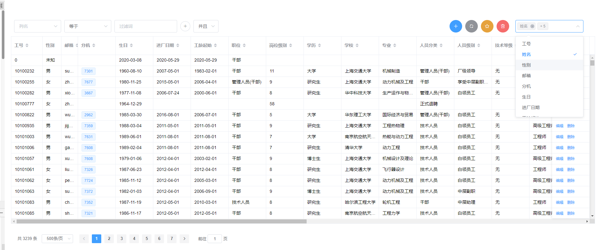
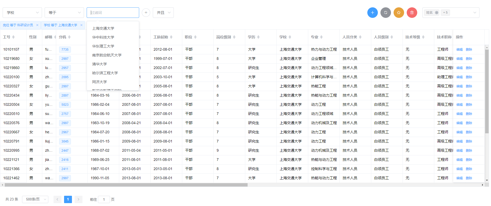
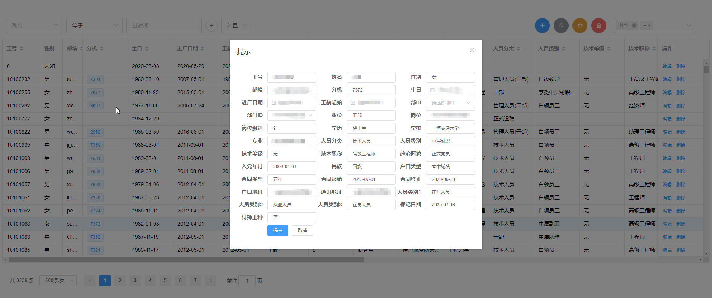
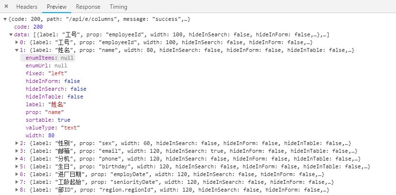

## easy_table: 一个后端驱动的Vue.js表格组件
#### 主要功能

- 表格的底层使用ElementUI的表格，引入pl-table作为可选项，用于对大表格进行虚拟化
- 表格默认功能支持多条件筛选、分页、排序、隐藏列等功能（需要后端接口支持）
- 表格支持插槽功能，用于自定义某列的渲染方式或样式
- 表格支持添加自定义按钮，默认按钮为编辑和删除
- 支持默认自动生成的新增、编辑表单






### 安装示例

```vue
npm install @gwt123/easy_table
```
或者在package.json中
```json
"dependencies": {
    "@gwt123/easy_table": "^0.1.7",
}
```
### 使用示例

```vue
<template>
    <div id="app">
        <EasyTable
            v-if="show"
            :default-query.sync="listQuery"			 <!-- 用于传出分页，筛选等表格内部信息-->
            :easy-columns="this.columns"			 <!-- 传入列定义-->
            :table-methods="tableMethods"			 <!-- 传入表格查询方法-->
            :form-methods="formMethods">			 <!-- 传入表单提交方法-->
            <template #phone="props">				 <!-- 自定义插槽 -->
                <el-tag size="small" v-if="props.row.phone">{{ props.row.phone }}</el-tag>
            </template>
            <template #buttons="props">
                    <el-button type="warning" icon="el-icon-star-off" circle @click="() => $alert('aaa')"></el-button>
                    <el-button type="danger" icon="el-icon-delete" circle></el-button>
            </template>
    </EasyTable>
    </div>
</template>

<script>
    import EasyTable from '../packages/components/EasyTable'
    import {
        getColumns,
        getEmployeesDetailCount,
        getEmployeesDetaildByPaging,
        getEmployeesDetaildByPagingWithFilter,
        getEmployeesDetaildByPagingWithFilterCount,
        getEmployeeDetailFieldOptions,
        changeEmployeeDetails
    } from './api/employee'

    export default {
        name: 'App',
        data() {
            return {
                listQuery: {},				// 用于传出分页，筛选等表格内部信息
                show: false,				// 是否隐藏表格
                columns: [],				// 表格的列定义，详见下文
                formMethods: {
                    onSubmitCreate: (form) => {	// 新增表单提交方法
                        alert("无法新增")
                    },
                    onSubmitUpdate: (form) => { // 编辑表单提交方法
                        changeEmployeeDetails(form).then(resp => console.log('OK'))
                        // console.log(form.department)
                    }
                },
                tableMethods: { // 5个后端查询接口
                    getAllListByPagingCount: getEmployeesDetailCount, // 获取总行数
                    getAllListByPaging: getEmployeesDetaildByPaging，  // 分页获取数据
                    getFilteredListByPaging: getEmployeesDetaildByPagingWithFilter,  // 筛选后分页获取数据
                    getFilteredListByPagingCount: getEmployeesDetaildByPagingWithFilterCount,   // 筛选后分页获取数据的行数
                    getOptions: getEmployeeDetailFieldOptions	// 筛选的提示项
                }
            }
        },
        created(){
          getColumns().then(resp => {
              this.columns = resp
              this.show = true
          })
        },
        mounted(){
        },
        watch:{
            listQuery: {
                handler(newValue, oldValue) {
                    // console.log(newValue)
                },
                immediate: true,
                deep: true
            }
        },
        methods: {
        },
        components: {
            EasyTable
        }
    }
</script>

<style lang="less">
    #app {
        font-family: Avenir, Helvetica, Arial, sans-serif;
        -webkit-font-smoothing: antialiased;
        -moz-osx-font-smoothing: grayscale;

        color: #2c3e50;
        margin-top: 60px;
    }
</style>

```


### 参数说明

#### 列定义

- 可直接写在`columns: [],`中传入，也可从后端接口调用，用于动态渲染列



```js
{
	label: "工号"					// 列名
	prop: "employeeId"			 // 列对应的属性，支持a.b的形式
	sortable: true				 // 可排序
	valueType: "text"			 // 值类型，text表示纯文本，enum表示数据字典/选择器选项
	width: 100					 // 列宽
	enumItems: null				 // 对应valueType: "enum"，如果可以枚举，可以直接传入选项数组
							// 如 [{"label": "男", value: 1}, {"label": "女", value: 0}]
	enumUrl: null				 // 对应valueType: "enum", 从后台url中获取选项，接口返回值如上
	fixed: "left"				 // "left"或"right"或null，左固定、右固定、不固定
	hideInForm: false			 // 是否在表单中隐藏，即该列不可编辑
	hideInSearch: false			 // 是否在筛选中隐藏,即该列不可筛选
	hideInTable: false			 // 是否在表格中隐藏，即该列不显示
}
```

#### 插槽

```vue
<template>
    <div id="app">
        <EasyTable
            v-if="show"
            :default-query.sync="listQuery"			 <!-- 用于传出分页，筛选等表格内部信息-->
            :easy-columns="this.columns"			 <!-- 传入列定义-->
            :table-methods="tableMethods"			 <!-- 传入表格查询方法-->
            :form-methods="formMethods">			 <!-- 传入表单提交方法-->
            <template #phone="props">				 <!-- 自定义插槽 -->
                <el-tag size="small" v-if="props.row.phone">{{ props.row.phone }}</el-tag>
            </template>
            <template #buttons="props">
                    <el-button type="warning" icon="el-icon-star-off" circle @click="() => $alert('aaa')"></el-button>
                    <el-button type="danger" icon="el-icon-delete" circle></el-button>
            </template>
    </EasyTable>
    </div>
</template>
```

- 重点在于`template #phone="props"`中是`#phone`这个会和列定义中的`prop`对应起来，进入插槽渲染
- `#buttons`对应左上角的按钮，如下图所示


#### 5个表格查询方法，需要对应后端接口

```js
export function getEmployeesDetaildByPaging(query) {
    let url = '/employeeDetails?page=' + (query.page - 1) + '&limit=' + query.limit
    if (query.sort) {
        url = url + '&sort=' + query.sort
    }
    return request({
        url: url,
        method: 'get'
    })
}

export function getEmployeesDetailCount() {
    return request({
        url: '/employeeDetails/count',
        method: 'get'
    })
}

export function getEmployeesDetaildByPagingWithFilter(query, filters, logit) {
    let url = '/employeeDetails/filter/' + logit + '?page=' + (query.page - 1) + '&limit=' + query.limit
    if (query.sort) {
        url = url + '&sort=' + query.sort
    }
    return request({
        url: url,
        method: 'post',
        data: filters
    })
}

export function getEmployeesDetaildByPagingWithFilterCount(filters, logit) {
    return request({
        url: '/employeeDetails/filter/count/' + logit,
        method: 'post',
        data: filters
    })
}

export function getEmployeeDetailFieldOptions(field) {
    return request({
        url: '/employeeDetails/filterField/' + field,
        method: 'get'
    })
}
```

后端接口

```java
    @ApiOperation(value = "查看员工详细信息(分页)")
    @GetMapping(value = "/e/pagable")
    public List<EmployeeDetail> getDataByPaging(@RequestParam(value = "page") int page,
                                                @RequestParam(value = "limit") int limit,
                                                @RequestParam(value = "sort", required = false) String sort) {
        return employeeDetailService.getEmployeeDetailsByPaging(page, limit, sort);
    }

    @GetMapping(value = "/e/dprt")
    public List<SelectOption> getDprtData(){
        return dprtRepository.findAllDprt().stream().map(Dprt::toSelectionOption).collect(Collectors.toList());
    }

    @GetMapping(value = "/e/region")
    public List<SelectOption> getRegionData(){
        return dprtRepository.findAllRegion().stream().map(Dprt::toSelectionOption).collect(Collectors.toList());
    }

    @ApiOperation(value = "查看员工详细信息(分页)")
    @GetMapping(value = "/e/pagable/count")
    public long getDataByPagingCount() {
        return employeeDetailService.getEmployeeDetailsByPagingCount();
    }


    @ApiOperation(value = "查看员工详细信息(分页)带过滤")
    @PostMapping(value = "/e/search/{logit}")
    public List<EmployeeDetail> getDataWithFilter(@RequestParam(value = "page") int page,
                                                  @RequestParam(value = "limit") int limit,
                                                  @RequestParam(value = "sort", required = false) String sort,
                                                  @RequestBody List<PredicateEntity> entities,
                                                  @PathVariable("logit") String logit) {
        return employeeDetailService.getEmployeeDetailByPageWithFilters(page, limit,sort, entities, logit);
    }

    @ApiOperation(value = "查看员工详细信息(分页)带过滤数量")
    @PostMapping(value = "/e/search/count/{logit}")
    public long getDataWithFilterCount(@RequestBody List<PredicateEntity> entities, @PathVariable("logit") String logit) {
        return employeeDetailService.getEmployeeDetailByPageWithFiltersCount(entities, logit);
    }

    @ApiOperation(value = "查看筛选能用到的可选择项")
    @GetMapping(value = "/e/filterField/{field}")
    public List<WebOption> getFilterOptions(@PathVariable("field") String field) {
        return employeeDetailService.getOptions(field);
    }
```

